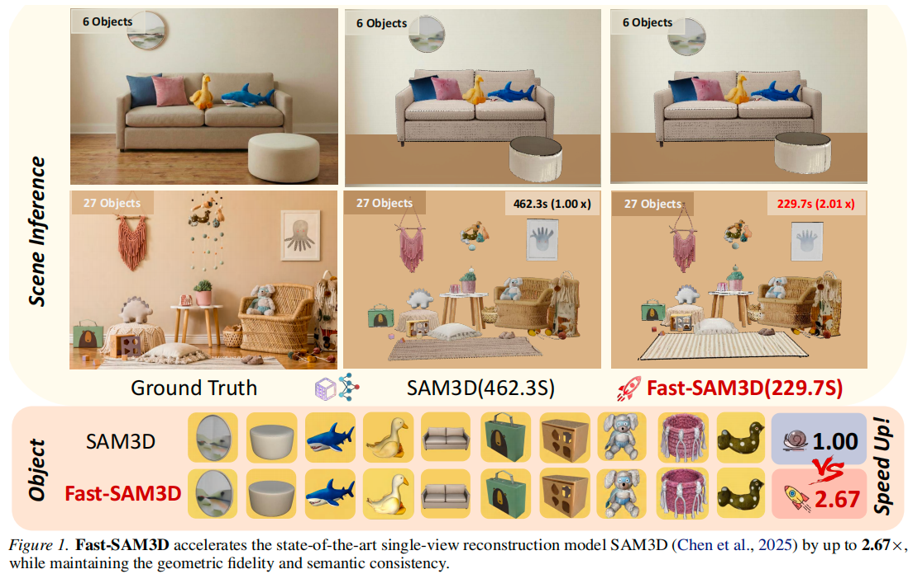
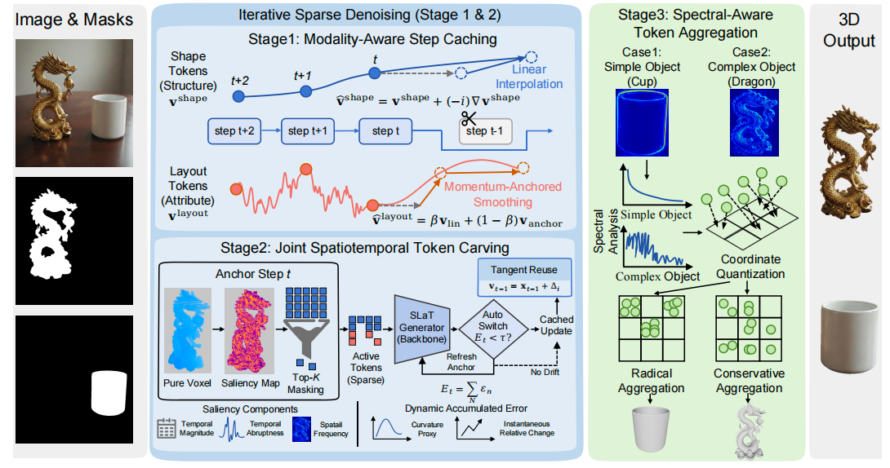
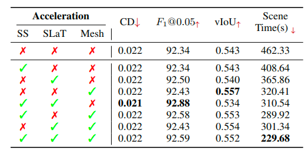

<h1 align="center">🚀 Fast-SAM3D: 3Dfy Anything in Images but Faster</h1>

<p align="center">
  <a href="https://arxiv.org/abs/xxxx.xxxxx">
    
  </a>
  <a href="https://github.com/wlfeng0509/Fast-SAM3D-3Dfy-Anything-in-Images-but-Faster">
    
  </a>
  <a href="https://huggingface.co/your-model">
    
  </a>
</p>


<div align="center">
**[Weilun Feng](https://github.com/wlfeng0509)<sup>*</sup>, [Mingqiang Wu](https://github.com/)<sup>*</sup>, [Zhiliang Chen](https://github.com/), [Chuanguang Yang](https://github.com/)<sup>✉</sup>, [Haotong Qin](https://github.com/), [Yuqi Li](https://github.com/), [Xiaokun Liu](https://github.com/), [Guoxin Fan](https://github.com/), [Zhulin An](https://github.com/)<sup>✉</sup>, [Libo Huang](https://github.com/), [Yulun Zhang](https://github.com/), [Michele Magno](https://github.com/), [Yongjun Xu](https://github.com/)**

<sup>*</sup>Equal Contribution  <sup>✉</sup>Corresponding Author

Institute of Computing Technology, Chinese Academy of Sciences
University of Chinese Academy of Sciences
China University of Mining and Technology
ETH Zürich
Shanghai Jiao Tong University

</div>

---

<p align="center">
  
</p>
<p align="center">
  <strong>Fast-SAM3D accelerates SAM3D by up to 2.67× while maintaining geometric fidelity and semantic consistency.</strong>
</p>


---

## 💡 TL;DR

**Fast-SAM3D** is a **training-free acceleration framework** for single-view 3D reconstruction that delivers **up to 2.67× speedup** with negligible quality loss. Our approach dynamically aligns computation with instantaneous generation complexity through three heterogeneity-aware mechanisms.

---

## 📋 Table of Contents

1. [News](#news)
2. [Highlights](#highlights)
3. [Method Overview](#method-overview)
4. [Installation](#installation)
5. [Usage](#usage)
6. [Results](#results)
7. [Citation](#citation)
8. [Acknowledgements](#acknowledgements)

---

## 📰 News

- **[2026.02.05]** 🎉 Paper and code released! Check out our [paper](https://arxiv.org/abs/xxxx.xxxxx).

---

## 🌟 Highlights

1. **🚀 Training-Free Acceleration**: Achieves **2.67× speedup** for single-object generation and **2.01× for scene generation** without any model retraining.

2. **🎯 Heterogeneity-Aware Design**: Addresses multi-level heterogeneity in 3D generation pipelines: kinematic distinctiveness, intrinsic sparsity, and spectral variance.

3. **🔧 Plug-and-Play Modules**: Three seamless integration modules:
   - **Modality-Aware Step Caching**: Decouples shape evolution from sensitive layout updates
   - **Joint Spatiotemporal Token Carving**: Concentrates refinement on high-entropy regions
   - **Spectral-Aware Token Aggregation**: Adapts decoding resolution to geometric complexity

4. **✨ Quality Preservation**: Maintains or even exceeds original model's geometric fidelity (F-Score: 92.59 vs. 92.34).

---

## 🔍 Method Overview

<p align="center">
  
</p>
<p align="center">
  <strong>Overview of Fast-SAM3D.</strong> Our approach integrates three heterogeneity-aware modules: (1) Modality-Aware Step Caching for decoupling structural evolution from layout updates; (2) Joint Spatiotemporal Token Carving for eliminating redundancy; (3) Spectral-Aware Token Aggregation for adaptive decoding resolution.
</p>

### Stage 1: Modality-Aware Step Caching

The Sparse Structure Generator exhibits **modality heterogeneity**: shape tokens evolve smoothly while layout tokens are volatile. We propose:
- **Linear Extrapolation** for shape tokens using finite-difference prediction
- **Momentum-Anchored Smoothing** for layout tokens to suppress high-frequency jitter

### Stage 2: Joint Spatiotemporal Token Carving

The SLaT Generator shows **intrinsic refinement sparsity**: updates concentrate on high-entropy regions. We design:
- **Unified Saliency Potential** combining temporal dynamics (magnitude & abruptness) and spatial frequency
- **Dynamic Adaptive Step Caching** with curvature-aware trajectory approximation

### Stage 3: Spectral-Aware Token Aggregation

The Mesh Decoder processes dense token sequences. We introduce:
- **Spectral Complexity Analysis** using High-Frequency Energy Ratio (HFER)
- **Instance-Adaptive Aggregation** with aggressive compression for simple shapes and detail preservation for complex geometries

---

## 🛠️ Installation

### Requirements

- Python >= 3.9
- PyTorch >= 2.0
- CUDA >= 11.8
- SAM3D dependencies

### Setup Environment

```bash
# Clone the repository
git clone https://github.com/wlfeng0509/Fast-SAM3D-3Dfy-Anything-in-Images-but-Faster.git
cd Fast-SAM3D-3Dfy-Anything-in-Images-but-Faster

# Create conda environment
conda create -n fastsam3d python=3.10
conda activate fastsam3d

# Install dependencies
pip install torch torchvision --index-url https://download.pytorch.org/whl/cu118
pip install -r requirements.txt
```

### Download Pretrained Models

```bash
# Download SAM3D checkpoint
mkdir -p checkpoints
# Place your SAM3D checkpoint in ./checkpoints/

# Or use HuggingFace
huggingface-cli download your-username/fast-sam3d --local-dir ./checkpoints
```

---

## 🚀 Usage

### Quick Start

```bash
# Generate 3D from single image + mask
python infer.py \
    --image_path examples/input.jpg \
    --mask_path examples/mask.png \
    --output_dir outputs/ \
    --enable_acceleration
```

### Acceleration Options

```bash
# Full Fast-SAM3D acceleration (default)
python infer.py \
    --image_path examples/input.jpg \
    --mask_path examples/mask.png \
    --enable_ss_cache \
    --enable_slat_carving \
    --enable_mesh_aggregation

# Customize acceleration strength
python infer.py \
    --image_path examples/input.jpg \
    --mask_path examples/mask.png \
    --cache_stride 3 \
    --momentum_beta 0.5 \
    --carving_ratio 0.1 \
    --spectral_threshold_low 0.5 \
    --spectral_threshold_high 0.7
```

### Batch Scene Generation

```bash
python infer_scene.py \
    --image_path examples/scene.jpg \
    --output_dir outputs/ \
    --enable_acceleration
```

---

## 📊 Results

### Quantitative Comparison

| Method | Visual ↑ | CD ↓ | F1@0.05 ↑ | vIoU ↑ | 3D-IoU ↑ | Scene Time ↓ | Speed ↑ |
|:-------|:--------:|:----:|:---------:|:------:|:--------:|:------------:|:-------:|
| SAM3D | 0.369 | 0.022 | 92.34 | 0.543 | 0.403 | 462.3s | 1.00× |
| Random Drop | 0.264 | 0.030 | 83.52 | 0.327 | 0.094 | 402.2s | 1.15× |
| Uniform Merge | 0.329 | 0.023 | 91.48 | 0.540 | 0.367 | 366.8s | 1.26× |
| Fast3Dcache | 0.348 | 0.022 | 91.31 | 0.505 | 0.051 | 443.3s | 1.04× |
| TaylorSeer | 0.344 | 0.028 | 90.95 | 0.504 | 0.374 | 265.6s | 1.74× |
| EasyCache | 0.342 | 0.028 | 87.06 | 0.432 | 0.186 | 244.9s | 1.89× |
| **Fast-SAM3D** | **0.350** | **0.022** | **92.59** | **0.552** | **0.375** | **229.7s** | **2.01×** |

### Speedup Analysis

<p align="center">
  
</p>

### Qualitative Comparison

<p align="center">
  
</p>
<p align="center">
  Fast-SAM3D produces results perceptually indistinguishable from SAM3D while generic strategies suffer from structural collapse (Random Drop) or semantic drift (TaylorSeer).
</p>
</p>

---

## 📄 Citation

If you find this work helpful, please consider citing:

```bibtex
@article{feng2026fastsam3d,
  title={Fast-SAM3D: 3Dfy Anything in Images but Faster},
  author={Feng, Weilun and Wu, Mingqiang and Chen, Zhiliang and Yang, Chuanguang and Qin, Haotong and Li, Yuqi and Liu, Xiaokun and Fan, Guoxin and An, Zhulin and Huang, Libo and Zhang, Yulun and Magno, Michele and Xu, Yongjun},
  journal={arXiv preprint arXiv:xxxx.xxxxx},
  year={2026}
}
```

---

## 🙏 Acknowledgements

This project is built upon the excellent [SAM3D](https://github.com/facebookresearch/sam-3d-objects) framework. We thank the authors for their outstanding work in open-world 3D reconstruction.

---

## 📜 License

This project is released under the [MIT License](LICENSE).

---

## 📧 Contact

For questions or suggestions, please open an issue or contact:
- Weilun Feng: [fengweilun24s@ict.ac.cn](fengweilun24s@ict.ac.cn)
- Chuanguang Yang: [yangchuanguang@ict.ac.cn](mailto:yangchuanguang@ict.ac.cn)
- Zhulin An: [anzhulin@ict.ac.cn](mailto:anzhulin@ict.ac.cn)

---

<p align="center">
  ⭐ Star us on GitHub if you find this project helpful!
</p>
